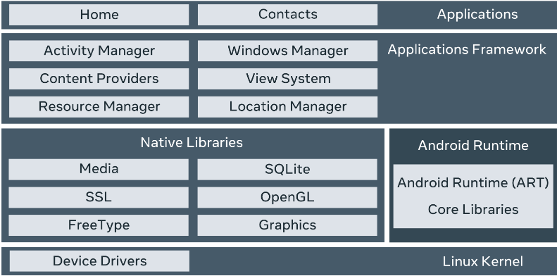

# **MODUL 1**
## **Android languages: Java and Kotlin**
Kotlin become the preferred language than Java, some of benefits:
- Kotlin is concise and time-saving 
- Simpler and fewer lines, reducing code errors and streamlining progamming
- Easy to maintain, read and change
- Kotlin is complete compatible with Java, can use Java command, libraries, fameworks
- Can convert Java code to Kotlin
## **The Android OS**

Android architecture have five sections:
1. Applications
2. Application Frameworks
3. Android Runtime
4. Platform Libraries
5. Linux Kernel

## **Android Studio** 
- Integrated Development Environment(IDE)
## **Project template**
- Some template avaiable : 
1. Basic activity template
2. Bottom navigation activity template
3. Empty activity template
 ## **Android App Cheat Sheet**
 ### Key Android Development concepts
 1. Top level component 
 
    connect internet, make a call, talk a picture with help of four top-level component classes: BroadcastReceiver, ContentProvider,Service and Activity accessible in the Android software development kit(SDK).
 2. Activity Components
    
    Activity present the content users can interact with on the screen
 3. Android views

    View occupy a rectangular area on the screen and are respondsible for drawing and event handling. View display text, Image,.... A combination of all of these Views forms a design interface     
 4. Android Layout Files

    Each layout is represented by an XML file. In addition to the XML, can create with Kotlin, Java. Also Google have create Jetpack Compose, create UI with Kotlin, Jave code.
 5. Project Files

    Three main categories: configuration, code and resource.
## **Anatomy of an Android App**
 Major component an Android app is made up
1. Activities
    
    It is like the Window or frame in Kotlin. With the help of activity, you can place all your user interface or UI components or widgets on a single screen. For example, a music player app may have an activity that shows you a list of your favorite songs, another activity that allows you to play a specific song, and another which shows you a list of trending songs
2. Services

    Then there is the services component, which runs in the background, serving as the invisible background worker of any Android application. Its function is to constantly update the data sources and activities with the latest changes. It also performs tasks when users are not active on applications. A good example of a service is chatting with someone whilst listening to music
3. Content providers
    
    Content providers is the last major component and is responsible for sharing data between one or more applications. This operation is based on request. A typical example is a social media app that allows users to share their images online.   
4. Broadcast receivers

    the broadcast receivers component. Its purpose is to respond to messages from other applications or systems in real-time. To illustrate, imagine you're enjoying your favorite song on your music app, when you get a notification that you're running low on battery power. Have you ever wondered how you get notifications like this? Well, broadcast receivers are responsible for such activities.
## **XML: Extensible Markup Language**

# **MODUL 2**

