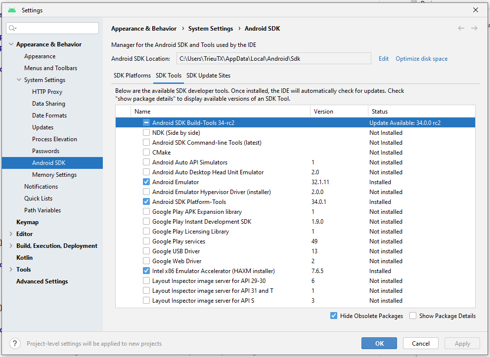
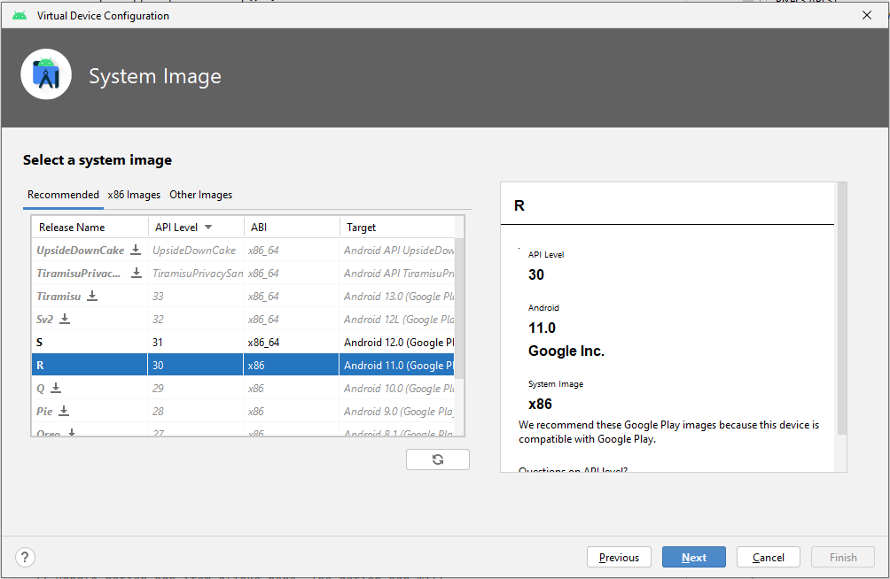
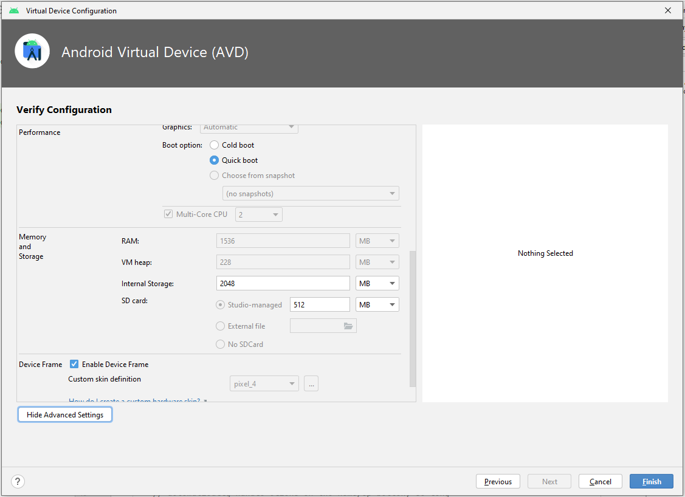
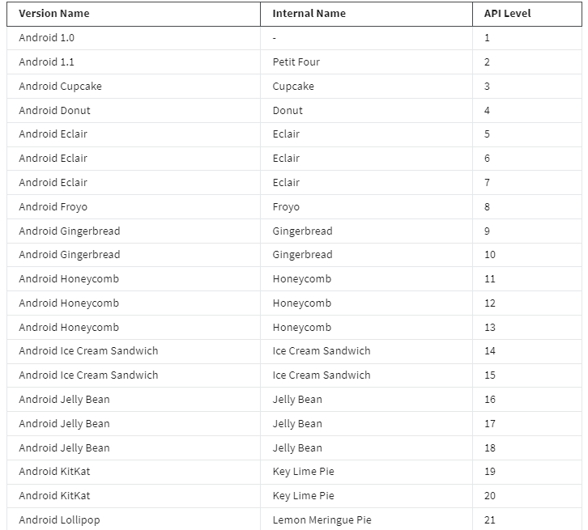

# **MODUL 1**
## **Android languages: Java and Kotlin**
Kotlin become the preferred language than Java, some of benefits:
- Kotlin is concise and time-saving 
- Simpler and fewer lines, reducing code errors and streamlining progamming
- Easy to maintain, read and change
- Kotlin is complete compatible with Java, can use Java command, libraries, fameworks
- Can convert Java code to Kotlin
## **The Android OS**

Android architecture have five sections:
1. Applications
2. Application Frameworks
3. Android Runtime
4. Platform Libraries
5. Linux Kernel

## **Android Studio** 
- Integrated Development Environment(IDE)
## **Project template**
- Some template avaiable : 
1. Basic activity template
2. Bottom navigation activity template
3. Empty activity template
 ## **Android App Cheat Sheet**
 ### Key Android Development concepts
 1. Top level component 
 
    connect internet, make a call, talk a picture with help of four top-level component classes: BroadcastReceiver, ContentProvider,Service and Activity accessible in the Android software development kit(SDK).
 2. Activity Components
    
    Activity present the content users can interact with on the screen
 3. Android views

    View occupy a rectangular area on the screen and are respondsible for drawing and event handling. View display text, Image,.... A combination of all of these Views forms a design interface     
 4. Android Layout Files

    Each layout is represented by an XML file. In addition to the XML, can create with Kotlin, Java. Also Google have create Jetpack Compose, create UI with Kotlin, Jave code.
 5. Project Files

    Three main categories: configuration, code and resource.
## **Anatomy of an Android App**
 Major component an Android app is made up
1. Activities
    
    It is like the Window or frame in Kotlin. With the help of activity, you can place all your user interface or UI components or widgets on a single screen. For example, a music player app may have an activity that shows you a list of your favorite songs, another activity that allows you to play a specific song, and another which shows you a list of trending songs
2. Services

    Then there is the services component, which runs in the background, serving as the invisible background worker of any Android application. Its function is to constantly update the data sources and activities with the latest changes. It also performs tasks when users are not active on applications. A good example of a service is chatting with someone whilst listening to music
3. Content providers
    
    Content providers is the last major component and is responsible for sharing data between one or more applications. This operation is based on request. A typical example is a social media app that allows users to share their images online.   
4. Broadcast receivers

    the broadcast receivers component. Its purpose is to respond to messages from other applications or systems in real-time. To illustrate, imagine you're enjoying your favorite song on your music app, when you get a notification that you're running low on battery power. Have you ever wondered how you get notifications like this? Well, broadcast receivers are responsible for such activities.
## **XML: Extensible Markup Language**

# **MODUL 2**
## **Emulator**
Setting up emulator software:
1. Dowload emulator from the SDK manager 
      
 

2. Select tool -> AVD Manager: create new Android Virtual Device
- Some defaul vitual device was insatlled when dowload Emulator
- Create a new virtual device: config hardware and software, settings screen resolution, screen pixel and ram or use defauls hardware offer by Android Studio.

- Setting Image have Android version, it's API level and Application Binary Interface(ABI). How app machine code interact with the computer 

- Config camare settings, network settings, performance and storage of virtual device.
- The performance section of the settings gives you three options:

    + Cold boot: It will start your device as if you’re turning it on for the first time.

    + Quick boot: It will remember the last state of your device and the next time you run the Android emulator it will show you the same screen.

    + Snapshot: This refers to the state of the Android emulator. You get to save the state yourself and it’ll kick off from the same page the next time you run the emulator.

The memory and storage section of the settings gives you options to configure the device RAM, VM heap, Internal storage and SD card.

 ## Resource https://developer.android.com/studio/run/managing-avds ; https://developer.android.com/studio/run/emulator-acceleration ; https://en.wikipedia.org/wiki/Android_version_history
## **Mobile CPU**
- A CPU is like a translator between the software and the hardware of a device. It can take high-level software instructions and translate them into native machine language that a mobile phone can understand and use to perform specific operations
- As of now, there are three main CPU architectures used in most smartphones – ARM, ARM64 and x86. CPU types include:

    - ARM: ARMv7 or armeabi

    - ARM64: AArch64 or arm64

    - x86: x86 or x86abi
## **OS versions and images**
- Some version of Android Studio

## **Common libraries and packages**
- Libraries extend the capabilities of the Android software develop kit(SDK), allow yout to use code written by other developer. Libraries provide new functionales, give access to awesome functions with lesser code as developer, just need Import
- the common libraries
    + Image loading: avoid high memory cause by loading multiple image at the same time, Presco.
    + 

    + Videos: Displaying videos is usually a daunting task for developers during development. Without the use of a library, the processes and details to take care of can be too numerous to handle, ExoPlayer.
    + 

    + Networking:Nowadays, virtually every mobile app needs some sort of network communication to perform one function or another. Fortunately, there are incredible networking libraries available to help you optimize this process, Retrofit.
    + 

## **Project Structure**

- Source code
- Assets
- Test code
- Build configurations

Some basic file:
- Same_app: root directory
- .gradle folder: refer to build toolkit that guides the project building process called Gradle.
- .ideal folder: store specific project metadata, tell app how to use the data it describes. a set of configuration files containing configuration data for specific functional areas.
- app folder: contain source code related to the project, UI,image,font, ...
- gradle folder: relate Android build system, set of tools made available to developers to build, test, and run their application. 
    + build.gradle: used to specify and manage the configuration options commonto all sub-projects folders.
    + Gradlew is a file that is used by Gradle Android Studios build system. It is only created once and is updated whenever a new feature or plugin is required to build a project.
    + local.properties : This file contains information specific to your local configuration. For example, the path to the software development kit or SDK. This is a file that you don't need to push into a version control system like GitHub because it contains sensitive local information
    + settings.gradle : handle the various settings for projects and modules
## **Main activity**
- 